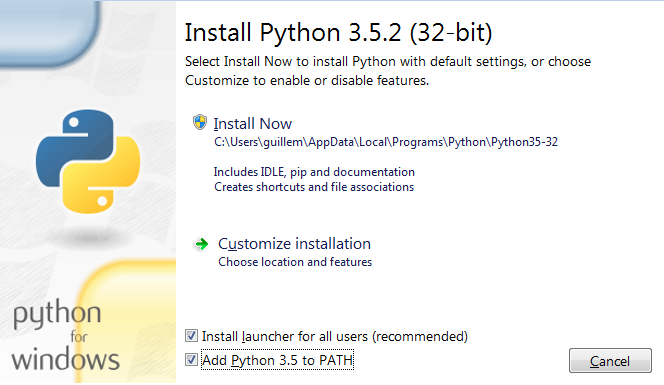

Antes de ponerse a programar
============================

Cómo instalar Python
--------------------

El proceso de instalación depende del sistema operativo con el que
estemos trabajando y del uso que queramos hacer del
intérprete

Windows
*******

La página web del proyecto principal, `python.org
<http://python.org>`_, cuenta con instaladores para Windows de todas
sus versiones. La página web detecta la versión del sistema operativo
y su arquitectura (si es de 32 o 64 bits) a partir de la información
que obtiene el navegador para ofrecer un instalador, pero este proceso
puede fallar. En cualquier caso se puede avanzar a partir de la
pestaña de descargas y seguir las sencillas instrucciones de la
página.

Este paquete instalable sabor *vainilla* instala la funcionalidades
mínimas para trabajar con Python. No instala ningún entorno de
desarrollo integrado ni muchas librerías necesarias para trabajar en
análisis de datos.

La única precaución importante que hay que tener al instalar este
paquete es seleccionar la primera casilla del diálogo para que el
intérprete de comandos pueda encontrar Python independientemente de
dónde lo abramos (*Add Python 3.5 to PATH*).

Otra opción para instalar Python en Windows es utilizar una
distribución que incluya una selección de paquetes más extensa. La más
popular es `Anaconda Python <https://www.continuum.io/downloads>`_,
publicada por la empresa Continuum Analytics. Aunque su uso es más
popular en Windows, Anaconda está disponible en los tres sistemas
operativos más comunes.
	   
Linux
*****

Lo más habitual en Linux es utilizar los paquetes disponibles para
cada distribución. Esto implica que Python puede presentar ligeras
diferencias en cada caso. Lo primero es asegurarnos que la versión de
Python que estamos utilizando es posterior a la 3.4. Para comprobarlo
lanzaremos este comando al intérprete de comandos::

  $> python --version
  Python 3.5.2

Puede que este comando devuelva una versión ligeramente anterior, como
la 3.4.x, lo que no representa ningún inconveniente. En el caso que la
versión de Python sea la 2, esto significa que la distribución enlaza
el nombre ``python`` al intérprete de Python 2, pero no implica que
Python 3 no esté instalado, sino que podemos acceder a él con otro
nombre::

  $> python3 --version
  Python 3.5.2

Sólo hay que instalar Python 3 manualmente en distribuciones muy poco
recientes, y el inconveniente de las versiones dejará de ser un
problema en un futuro muy cercano.

Mac OSX
*******

Este sistema operativo siempre dispone de Python, pero lo más habitual
es que se trate de una versión muy poco reciente. Este caso se puede
tratar de manera parecida a Windows, y podemos escoger la distribución
original del proyecto Python o Anaconda.

Entornos de desarrollo
----------------------

Paquetes adicionales
--------------------

Pip
***

Una parte fundamental del ecosistema Python es su gestor de paquetes
**pip**, así que debemos procurar tenerlo instalado. Prácticamente todas las

Conda
*****

Conda es el gestor de paquetes alternativo a Pip que incluye 
